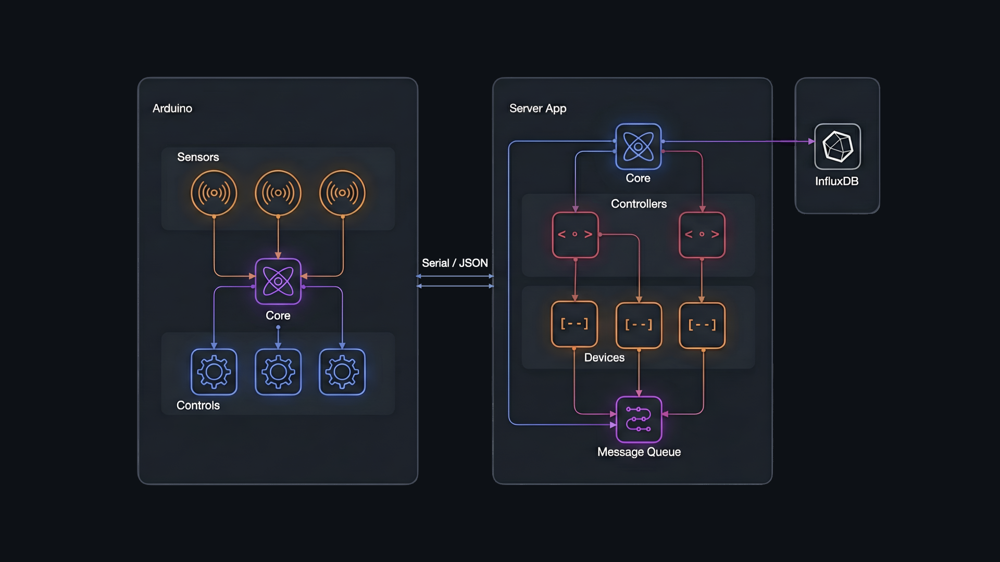

# Katosup 
Modular automation system for indoor plant environments, built with Arduino and Python. 

## Features

- **Climate And Soil Moisture Control**
- **Data Logging & Visualization:** Backed by InfluxDB, enabling time-series data storage and interactive dashboard
  visualization through its built-in UI.
- **Modular Architecture:** Structured around interchangeable sensor and actuator modules (e.g., alarms, lights, pumps).
  Devices can be added or removed by plugging them into well-defined integration points, without altering the system’s
  core logic. The core of the system is generic and reusable, supporting any combination of
  devices for any purpose.
- **Python Control App:** Receives sensor data from Arduino, makes control decisions, sends commands to actuators. CLI-based
  manual override is supported.
- **Dockerized Deployment:** Python app and InfluxDB run in isolated container.

## Project Structure

- `app/`: Python application (`katosup`) that communicates with embedded devices, controls actuators, and logs data
  to InfluxDB.
- `arduino/`: PlatformIO-based firmware for Arduino-compatible boards, responsible for reading sensors and receiving
  control commands.
- `Makefile`: Unification of dev commands across both environments.

## Architectural View

    

