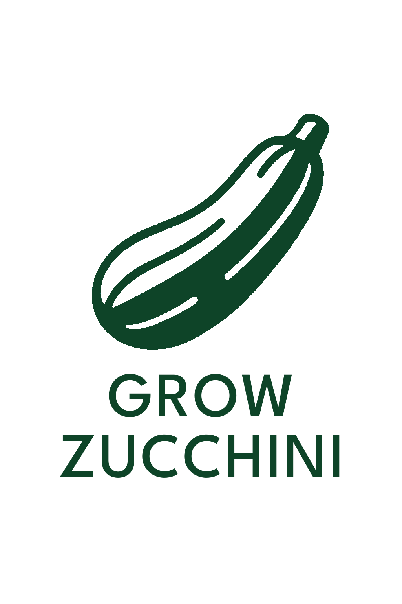

    

GrowZucchini is a modular automation system for indoor plant environments, built with Arduino and Python. It supports monitoring and control of key environmental factors, including:

    Climate And Soil Moisture Control: Controls temperature, humidity, and soil moisture.

    Growth Condition Logging: Records sensor data to InfluxDB and visualizes it in InfluxDB UI for long-term analysis and optimization.

    Modular Architecture: Add or remove sensors/controls (e.g. alarms, lights, pumps) with minimal code changes.

    Python Control App: Communicates with Arduino, supports CLI-based manual overrides, and manages data storage.

    Dockerized Deployment: Python app and InfluxDB run in isolated containers for portability and stability.

Whether you're automating a grow box, greenhouse, or hydroponic setup, GrowZucchini gives you real-time insights and control over your plant's environment.